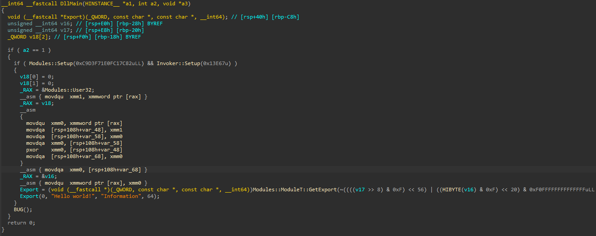
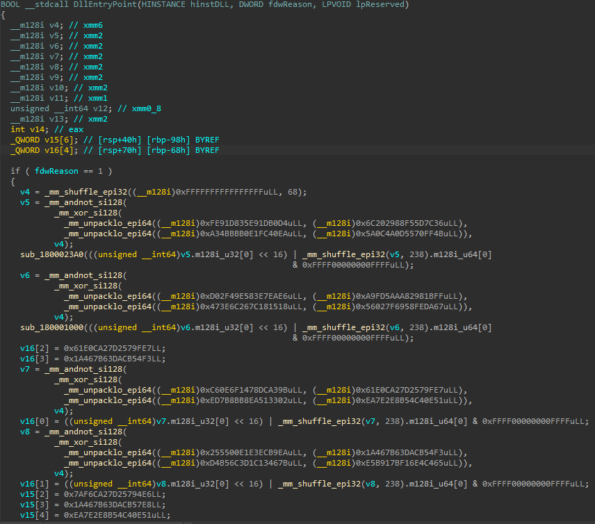

# ephemera

`ephemera` is a small C++20 toolkit for 64-bit Windows projects that combines compile-time constant obfuscation, wrapped scalar storage, manual module/export lookup and an indirect-call invoker

## Features

- Compile-time transformation of narrow and wide string literals
- Obfuscated 64-bit integer and immediate values
- Register-backed helpers for `float` and `double` constants
- Wrapped storage for scalar and pointer values
- x64 address helpers for casts, offsets, and relative-address resolution
- Calls with a prepared stack layout and synthetic return chain
- No dynamic allocation in the code

## Screenshots

| Debug | Release |
|:---:|:---:|
|  |  |

## Requirements

- 64-bit Windows (x86 and ARM are not supported)
- C++20
- ClangCL with support for GNU-style inline assembly
- SSE2 intrinsics

## Building the example

Open `ephemera-example/ephemera-example.vcxproj` in Visual Studio

Before using the project, replace the example seed in both configurations:

```text
C/C++ -> Preprocessor -> Preprocessor Definitions
```

The supplied `Release` configuration is a DLL with a custom entry point, optimizations enabled, exceptions disabled, and default libraries ignored. Those linker choices belong to the example and are not required when integrating ephemera into an existing project

## License

ephemera is distributed under the [GNU Affero General Public License v3.0 or later](LICENSE)
